# Entity Specification

This document describes the current JPA entity model for the paper trading service.
It is intended as context for AI agents and developers working on this codebase.

## Package Conventions

- Entity package: `com.papertrade.paper_trading.Entity`
- Enum package: `com.papertrade.paper_trading.Enum`
- DTO package: `com.papertrade.paper_trading.Dto`
- Controller package: `com.papertrade.paper_trading.Controller`
- Service package: `com.papertrade.paper_trading.Service`
- Repository package: `com.papertrade.paper_trading.Repository`
- Security package: `com.papertrade.paper_trading.Security`
- Config package: `com.papertrade.paper_trading.Config`
- Persistence API: `jakarta.persistence`
- Common entity style:
  - `@Getter`
  - `@NoArgsConstructor(access = AccessLevel.PROTECTED)`
  - `@AllArgsConstructor(access = AccessLevel.PRIVATE)`
  - `@Builder`
  - lazy relations by default
  - `BigDecimal` for money, prices, rates, and percentages
  - `LocalDateTime` for ordinary timestamps
  - `OffsetDateTime` for API timestamps that include timezone offsets

## Domain Overview

The service is a paper trading platform. A user owns exactly one account. The account can place orders, receive executions, and hold stocks. Every asset movement (account opening, fills, fees, taxes) is recorded in a double-entry ledger. Users can request a new paper trading amount after exhausting their current account balance. Funding request history is preserved for cumulative performance calculation.

Leaderboard rankings are materialized ranking rows updated by batch after market close. They are derived data, not the source of truth.

## Relationship Summary

```text
users 1 : 1 accounts
users 1 : N refresh_tokens

accounts 1 : N orders
accounts 1 : N holdings
accounts 1 : N ledger_entries
accounts 1 : N daily_account_snapshots
accounts 1 : N account_funding_requests
accounts 1 : N account_resets
accounts 1 : 1 leaderboard_rankings

stocks 1 : N orders
stocks 1 : N holdings
stocks 1 : N ledger_entries, SECURITIES entries only
stocks 1 : N stock_prices
stocks 1 : 0..1 stock_korean_market_details

orders 1 : N executions

ledger_transactions 1 : N ledger_entries
ledger_transactions 1 : N executions, optional reference (an internal fill links two executions to one transaction)
ledger_transactions 0..1 : N ledger_transactions, reversal_of

exchange_rates has no FK relation.
```

## Enums

### `Role`

Used by `User.role`.

```text
USER
ADMIN
```

### `Status`

Used by `User.status`.

```text
ACTIVE
SUSPENDED
WITHDRAWN
```

### `AccountStatus`

Used by `Account.status`.

```text
ACTIVE
SUSPENDED
CLOSED
```

### `Market`

Used by `Stock.market`.

```text
KOSPI
KOSDAQ
KONEX
NASDAQ
NYSE
AMEX
```

### `SecurityType`

Used by `Stock.securityType`.

```text
STOCK
ETF
ETN
```

### `StockStatus`

Used by `Stock.status`.

```text
ACTIVE
HALTED
DELISTED
```

### `OrderSide`

Used by `Order.orderSide`.

```text
BUY
SELL
```

### `OrderType`

Used by `Order.orderType`.

```text
MARKET
LIMIT
```

### `OrderStatus`

Used by `Order.status`.

```text
AWAITING_PRICE
PENDING
PARTIALLY_FILLED
FILLED
CANCELED
REJECTED
EXPIRED
```

- `AWAITING_PRICE`: accepted without a current price. Not matchable until the price-dependent checks (limit price band, market-order price conversion, market-buy orderable amount) finish. Reserves cash/quantity like an open order.
- `EXPIRED`: a day order that was still open when the trading day ended.

### `LedgerAccount`

Used by `LedgerEntry.ledgerAccount`. Signs follow standard accounting: asset accounts (`CASH`, `SECURITIES`) increase with `+`, revenue/equity accounts (`REALIZED_PNL`, `EQUITY_FUNDING`) increase with `−`, expense accounts (`FEE`, `TAX`) accrue with `+`.

```text
CASH            cash balance
SECURITIES      cost basis of held securities, not market value
REALIZED_PNL    realized profit and loss; a profit is a credit (−)
FEE             commission expense
TAX             transaction tax expense
EQUITY_FUNDING  paper money granted; counter-account of opening and funding
```

### `LedgerTransactionType`

Used by `LedgerTransaction.transactionType`.

```text
ACCOUNT_OPENING
FUNDING
TRADE
FEE
ADJUSTMENT
RESET
```

### `Currency`

Used by `ExchangeRate.baseCurrency` and `ExchangeRate.quoteCurrency`.

```text
USD
KRW
```

### `RateChangeType`

Used by `ExchangeRate.rateChangeType`.

```text
UP
DOWN
EVEN
```

## Entities

## `User`

Class: `User`

Table: `users`

Purpose: Stores member identity, login, role, and lifecycle status.

Columns:

| Field | Column | Java Type | DB Meaning | Constraints |
| --- | --- | --- | --- | --- |
| `id` | `id` | `Long` | Primary key | PK, identity |
| `email` | `email` | `String` | Login email | unique, not null |
| `passwordHash` | `password_hash` | `String` | Hashed password only | not null |
| `nickname` | `nickname` | `String` | Display nickname | unique, not null, length 50 |
| `status` | `status` | `Status` | User status | enum string, not null |
| `role` | `role` | `Role` | User role | enum string, not null |
| `createdAt` | `created_at` | `LocalDateTime` | Created timestamp | not null, creation timestamp |
| `updatedAt` | `updated_at` | `LocalDateTime` | Updated timestamp | not null, update timestamp |

Relations:

- `User` 1:1 `Account`
- `User` 1:N `RefreshToken`

Notes:

- Do not store raw passwords.
- `passwordHash` should contain a BCrypt or equivalent password hash.

## `Account`

Class: `Account`

Table: `accounts`

Purpose: Stores the user's single paper trading account and current account state.

Columns:

| Field | Column | Java Type | DB Meaning | Constraints |
| --- | --- | --- | --- | --- |
| `id` | `id` | `Long` | Primary key | PK, identity |
| `user` | `user_id` | `User` | Account owner | FK, unique, not null |
| `accountNumber` | `account_number` | `String` | Account number | unique, not null, length 30 |
| `cashBalance` | `cash_balance` | `BigDecimal` | Current cash balance | numeric(19,2), not null |
| `initialBalance` | `initial_balance` | `BigDecimal` | Current round requested amount | numeric(19,2), not null |
| `totalAssetValue` | `total_asset_value` | `BigDecimal` | Current total asset value | numeric(19,2), not null |
| `currentRound` | `current_round` | `Integer` | Current funding round number | not null, default 1 |
| `realizedProfit` | `realized_profit` | `BigDecimal` | Current round realized profit | numeric(19,2), not null, default 0 |
| `status` | `status` | `AccountStatus` | Account status | enum string, not null |
| `createdAt` | `created_at` | `LocalDateTime` | Created timestamp | not null, creation timestamp |
| `updatedAt` | `updated_at` | `LocalDateTime` | Updated timestamp | not null, update timestamp |

Constraints:

- `current_round > 0`
- `cash_balance >= 0`. The fill-time cash cap is not the only defense; a broken cap is rejected by the database instead of silently storing a negative balance.
- `user_id` is unique, so a user can own only one account.

Relations:

- `Account` 1:1 `User`
- `Account` 1:N `Order`
- `Account` 1:N `Holding`
- `Account` 1:N `LedgerEntry`
- `Account` 1:N `DailyAccountSnapshot`
- `Account` 1:N `AccountFundingRequest`
- `Account` 1:N `AccountReset`
- `Account` 1:1 `LeaderboardRanking`

Notes:

- `initialBalance` represents the requested amount for the current trading round.
- `cashBalance` and `realizedProfit` are caches derived from the ledger: `cash_balance = Σ(CASH entries)`, `realized_profit = −Σ(REALIZED_PNL entries)`. Daily reconciliation verifies them.
- `totalAssetValue` is refreshed by `TotalAssetValuationScheduler` from cash plus market value. It is not ledger-derived and is not used by any read path yet.
- Orderable cash is not stored. It is `cash_balance − Σ(reserved_unit_price × remaining_quantity + estimated commission + estimated tax)` over the account's open buy orders (`AWAITING_PRICE`, `PENDING`, `PARTIALLY_FILLED`), computed by `CashReservationCalculator`. Fees are summed per order in Java because fee schedules (minimum commission, tiers) cannot be expressed in SQL.
- `AccountOpeningService.open()` creates the account and its `ACCOUNT_OPENING` ledger transaction in one DB transaction. Sign-up does not call it yet.
- Cumulative performance should be calculated from `AccountFundingRequest` history plus the current account state, scoped after the latest `AccountReset.resetAt` when a reset exists. Do not use `LeaderboardRanking` as the source of truth.

## `AccountFundingRequest`

Class: `AccountFundingRequest`

Table: `account_funding_requests`

Purpose: Stores each paper-money funding request or round transition for an account. This does not represent cumulative performance reset events.

Columns:

| Field | Column | Java Type | DB Meaning | Constraints |
| --- | --- | --- | --- | --- |
| `id` | `id` | `Long` | Primary key | PK, identity |
| `account` | `account_id` | `Account` | Account | FK, not null |
| `roundNo` | `round_no` | `Integer` | Funding round number | not null |
| `requestedAmount` | `requested_amount` | `BigDecimal` | Requested paper money amount | numeric(19,2), not null |
| `assetBeforeReset` | `asset_before_reset` | `BigDecimal` | Total asset before reset | numeric(19,2), not null, default 0 |
| `profitBeforeReset` | `profit_before_reset` | `BigDecimal` | Profit before reset | numeric(19,2), not null, default 0 |
| `returnRateBeforeReset` | `return_rate_before_reset` | `BigDecimal` | Return rate before reset | numeric(10,6), not null, default 0 |
| `requestedAt` | `requested_at` | `LocalDateTime` | Request timestamp | not null, creation timestamp |

Constraints:

- unique `(account_id, round_no)`
- `round_no > 0`
- `requested_amount >= 1000`
- `requested_amount <= 100000`

Business rules:

- A user can request a new amount after using up the current amount.
- Valid requested amounts are any amount from `1000` to `100000`, inclusive. There is no fixed amount interval constraint.
- A user can request funding at most once per day. Enforce this in the service layer using `requestedAt`.
- The cumulative requested amount cap is `5,000,000`. Enforce this in the service/query layer using `requestedAmount`.
- If an `AccountReset` exists, cumulative calculations should include only funding requests with `requestedAt > MAX(account_resets.reset_at)` for the account.
- Cumulative profit amount:

```text
SUM(scoped account_funding_requests.profit_before_reset)
+ (accounts.total_asset_value - accounts.initial_balance)
```

- Cumulative return rate:

```text
cumulative_profit_amount / SUM(scoped account_funding_requests.requested_amount)
```

## `AccountReset`

Class: `AccountReset`

Table: `account_resets`

Purpose: Stores user-requested cumulative performance reset events. This is separate from `AccountFundingRequest` because resetting cumulative leaderboard/accounting scope and requesting a new trading round are different events.

Columns:

| Field | Column | Java Type | DB Meaning | Constraints |
| --- | --- | --- | --- | --- |
| `id` | `id` | `Long` | Primary key | PK, identity |
| `account` | `account_id` | `Account` | Reset target account | FK, not null |
| `cumulativeReturnRateBeforeReset` | `cumulative_return_rate_before_reset` | `BigDecimal` | Cumulative return rate snapshot before reset | numeric(10,6), not null |
| `cumulativeProfitAmountBeforeReset` | `cumulative_profit_amount_before_reset` | `BigDecimal` | Cumulative profit amount snapshot before reset | numeric(19,2), not null |
| `cumulativeRequestedAmountBeforeReset` | `cumulative_requested_amount_before_reset` | `BigDecimal` | Cumulative requested amount snapshot before reset | numeric(19,2), not null |
| `resetAt` | `reset_at` | `LocalDateTime` | Reset timestamp | not null, creation timestamp |

Relations:

- `AccountReset` N:1 `Account`

Business rules:

- A user can request cumulative reset regardless of cumulative return rate.
- `Account.currentRound` continues increasing after reset. It is not reset to `1`.
- Reset does not delete historical `AccountFundingRequest`, `Order`, `Execution`, ledger, or snapshot rows.
- Leaderboard and cumulative funding-cap queries should scope calculations to data after the latest `resetAt`.

## `Stock`

Class: `Stock`

Table: `stocks`

Purpose: Common stock master for US and Korean stocks based on Toss Securities API response.

Columns:

| Field | Column | Java Type | DB Meaning | Constraints |
| --- | --- | --- | --- | --- |
| `id` | `id` | `Long` | Primary key | PK, identity |
| `symbol` | `symbol` | `String` | Stock symbol, e.g. `AAPL`, `005930` | unique, not null, length 20 |
| `name` | `name` | `String` | Korean display name | not null, length 100 |
| `englishName` | `english_name` | `String` | English name | length 100 |
| `isinCode` | `isin_code` | `String` | ISIN code | unique, length 20 |
| `market` | `market` | `Market` | Listed market | enum string, not null |
| `securityType` | `security_type` | `SecurityType` | Security type | enum string, not null |
| `isCommonShare` | `is_common_share` | `Boolean` | Common-share flag | not null |
| `status` | `status` | `StockStatus` | Trading/listing status | enum string, not null |
| `currency` | `currency` | `String` | Trading currency | not null, length 10 |
| `listDate` | `list_date` | `LocalDate` | Listing date | nullable |
| `delistDate` | `delist_date` | `LocalDate` | Delisting date | nullable |
| `sharesOutstanding` | `shares_outstanding` | `Long` | Shares outstanding | nullable |
| `leverageFactor` | `leverage_factor` | `BigDecimal` | Leverage factor for leveraged products | numeric(10,4), nullable |

Relations:

- `Stock` 1:N `Order`
- `Stock` 1:N `Holding`
- `Stock` 1:N `StockPrice`
- `Stock` 1:0..1 `StockKoreanMarketDetail`

Notes:

- Korean stock symbols may contain leading zeroes, so use `String`, not numeric types.
- US stocks usually have no `StockKoreanMarketDetail`.

## `StockKoreanMarketDetail`

Class: `StockKoreanMarketDetail`

Table: `stock_korean_market_details`

Purpose: Stores Korea-only market detail from Toss Securities stock master response.

Columns:

| Field | Column | Java Type | DB Meaning | Constraints |
| --- | --- | --- | --- | --- |
| `stockId` | `stock_id` | `Long` | PK and FK to stock | PK, FK |
| `stock` | `stock_id` | `Stock` | Parent stock | one-to-one, maps id |
| `liquidationTrading` | `liquidation_trading` | `Boolean` | Liquidation trading flag | not null |
| `nxtSupported` | `nxt_supported` | `Boolean` | NXT supported flag | not null |
| `krxTradingSuspended` | `krx_trading_suspended` | `Boolean` | KRX trading suspended flag | not null |
| `nxtTradingSuspended` | `nxt_trading_suspended` | `Boolean` | NXT trading suspended flag | not null |

Relations:

- `StockKoreanMarketDetail` 1:1 `Stock`

Implementation:

- Uses `@OneToOne`, `@MapsId`, and `stock_id` as both PK and FK.

## `Order`

Class: `Order`

Table: `orders`

Purpose: Stores submitted buy/sell orders.

Columns:

| Field | Column | Java Type | DB Meaning | Constraints |
| --- | --- | --- | --- | --- |
| `id` | `id` | `Long` | Primary key | PK, identity |
| `account` | `account_id` | `Account` | Ordering account | FK, not null |
| `stock` | `stock_id` | `Stock` | Ordered stock | FK, not null |
| `clientOrderId` | `client_order_id` | `String` | Client idempotency key | nullable, length 36 |
| `orderSide` | `order_side` | `OrderSide` | Buy or sell | enum string, not null |
| `orderType` | `order_type` | `OrderType` | Market or limit | enum string, not null |
| `orderPrice` | `order_price` | `BigDecimal` | Limit price. Market orders get current price ±10% at acceptance | numeric(19,4), nullable |
| `reservedUnitPrice` | `reserved_unit_price` | `BigDecimal` | Cash reserved per share while the order is open. Equals `orderPrice` for buys, null for sells and for orders still awaiting a price | numeric(19,4), nullable |
| `orderQuantity` | `order_quantity` | `Long` | Ordered quantity | not null |
| `filledQuantity` | `filled_quantity` | `Long` | Filled quantity | not null, default 0 |
| `remainingQuantity` | `remaining_quantity` | `Long` | Remaining quantity | not null |
| `status` | `status` | `OrderStatus` | Order status | enum string, not null |
| `submittedAt` | `submitted_at` | `LocalDateTime` | Submitted timestamp | not null, creation timestamp |
| `canceledAt` | `canceled_at` | `LocalDateTime` | Canceled timestamp | nullable |
| `rejectedAt` | `rejected_at` | `LocalDateTime` | Rejected timestamp | nullable |
| `closeReason` | `close_reason` | `String` | Why the order was closed by the system: rejection, remaining-quantity cancellation, or day-end expiry. Renamed from `reject_reason` | varchar(255), nullable |
| `updatedAt` | `updated_at` | `LocalDateTime` | Updated timestamp | not null, update timestamp |

Constraints:

- `order_quantity > 0`
- `filled_quantity >= 0`
- `remaining_quantity >= 0`
- `filled_quantity + remaining_quantity = order_quantity`
- unique `(account_id, client_order_id)`

Relations:

- `Order` N:1 `Account`
- `Order` N:1 `Stock`
- `Order` 1:N `Execution`

Notes:

- Market orders are converted to limit orders at acceptance: current price +10% for buys, −10% for sells (`order.market-price.margin`). `orderPrice` is `null` only while the order is `AWAITING_PRICE`.
- Limit prices must be within current price ±50% (`order.price-band.margin`).
- `reservedUnitPrice` equals `orderPrice` for buys, `null` for sells and for market orders still awaiting a price.
- `clientOrderId` is optional but recommended. When supplied, it is used for idempotent order submission per account.
- `Order.reject(reason)` closes an order as `REJECTED`, or as `CANCELED` when it already has fills (`REJECTED` means the acceptance itself was invalid, which contradicts a partial fill). `closeReason` and `filledQuantity` are preserved either way.
- Index `idx_orders_account_side_status (account_id, order_side, status)` supports aggregating reserved cash on every order acceptance.

## `Execution`

Class: `Execution`

Table: `executions`

Purpose: Stores execution fills for an order. One order can be filled multiple times.

Columns:

| Field | Column | Java Type | DB Meaning | Constraints |
| --- | --- | --- | --- | --- |
| `id` | `id` | `Long` | Primary key | PK, identity |
| `order` | `order_id` | `Order` | Parent order | FK, not null |
| `executionPrice` | `execution_price` | `BigDecimal` | Execution price | numeric(19,4), not null |
| `executionQuantity` | `execution_quantity` | `Long` | Executed quantity | not null |
| `ledgerTransaction` | `ledger_transaction_id` | `LedgerTransaction` | Ledger transaction this fill produced | FK, nullable |
| `tradeId` | `trade_id` | `String` | Unique key of the fill event. Same value as the ledger idempotency key `FILL:{tradeId}` | nullable, length 36 |
| `commission` | `commission` | `BigDecimal` | Commission amount. Display copy only | numeric(19,2), not null, default 0 |
| `tax` | `tax` | `BigDecimal` | Tax amount. Display copy only | numeric(19,2), not null, default 0 |
| `executedAt` | `executed_at` | `LocalDateTime` | Execution timestamp | not null, creation timestamp |

Relations:

- `Execution` N:1 `Order`
- `Execution` N:0..1 `LedgerTransaction`

Notes:

- An internal fill creates two `Execution` rows (buy side and sell side) that share one `tradeId` and one `LedgerTransaction`. An external fill creates one.
- `commission` and `tax` are denormalized copies for the execution history screen. Balances and profit are always based on the `FEE`/`TAX` ledger entries. Daily reconciliation compares their totals.

## `Holding`

Class: `Holding`

Table: `holdings`

Purpose: Stores current stock positions per account.

Columns:

| Field | Column | Java Type | DB Meaning | Constraints |
| --- | --- | --- | --- | --- |
| `id` | `id` | `Long` | Primary key | PK, identity |
| `account` | `account_id` | `Account` | Account | FK, not null |
| `stock` | `stock_id` | `Stock` | Stock | FK, not null |
| `quantity` | `quantity` | `Long` | Current holding quantity | not null |
| `averagePrice` | `average_price` | `BigDecimal` | Average purchase price | numeric(19,4), not null |
| `totalPurchaseAmount` | `total_purchase_amount` | `BigDecimal` | Total purchase amount | numeric(19,2), not null |
| `updatedAt` | `updated_at` | `LocalDateTime` | Updated timestamp | not null, update timestamp |

Constraints:

- unique `(account_id, stock_id)`
- `quantity >= 0 and total_purchase_amount >= 0`

Relations:

- `Holding` N:1 `Account`
- `Holding` N:1 `Stock`

Notes:

- There should be only one holding row per `(account, stock)`.
- `quantity` and `totalPurchaseAmount` are caches derived from the ledger: `Σ(SECURITIES entries.quantity)` and `Σ(SECURITIES entries.amount)`. Daily reconciliation verifies them.
- When quantity returns to 0, `averagePrice` and `totalPurchaseAmount` are reset to 0.

## `LedgerTransaction`

Class: `LedgerTransaction`

Table: `ledger_transactions`

Purpose: One economic event (account opening, a fill, a fee, an adjustment). The amounts of its `LedgerEntry` rows always sum to 0. Append-only: recorded transactions are never updated or deleted. A correction is a new transaction with reversed signs linked through `reversalOf`.

Columns:

| Field | Column | Java Type | DB Meaning | Constraints |
| --- | --- | --- | --- | --- |
| `id` | `id` | `Long` | Primary key | PK, sequence `ledger_transactions_seq` (allocationSize 50) |
| `transactionType` | `transaction_type` | `LedgerTransactionType` | Event type | enum string, not null, length 30 |
| `idempotencyKey` | `idempotency_key` | `String` | Prevents recording the same event twice. `FILL:{tradeId}` for fills, `OPEN:{accountId}` for account opening | unique, not null, length 100 |
| `occurredAt` | `occurred_at` | `LocalDateTime` | Event timestamp | not null, creation timestamp |
| `description` | `description` | `String` | Human-readable description | nullable, length 255 |
| `reversalOf` | `reversal_of_id` | `LedgerTransaction` | Original transaction when this is a correction | FK, nullable |

Relations:

- `LedgerTransaction` 1:N `LedgerEntry`
- `LedgerTransaction` 1:N `Execution`
- `LedgerTransaction` N:0..1 `LedgerTransaction` (`reversalOf`)

## `LedgerEntry`

Class: `LedgerEntry`

Table: `ledger_entries`

Purpose: One posting line — which account's which ledger account moved by how much. Cash, holdings, and realized profit are all derived from this table; the corresponding columns on `accounts` and `holdings` are read caches verified by reconciliation.

Columns:

| Field | Column | Java Type | DB Meaning | Constraints |
| --- | --- | --- | --- | --- |
| `id` | `id` | `Long` | Primary key | PK, sequence `ledger_entries_seq` (allocationSize 50) |
| `transaction` | `transaction_id` | `LedgerTransaction` | Parent transaction | FK, not null |
| `account` | `account_id` | `Account` | Account | FK, not null |
| `ledgerAccount` | `ledger_account` | `LedgerAccount` | Ledger account | enum string, not null, length 30 |
| `stock` | `stock_id` | `Stock` | Stock, `SECURITIES` only | FK, nullable |
| `amount` | `amount` | `BigDecimal` | Debit `+`, credit `−` | numeric(19,2), not null |
| `quantity` | `quantity` | `Long` | Share movement, `SECURITIES` only | nullable |
| `balanceAfter` | `balance_after` | `BigDecimal` | Running balance right after this entry. Filled only for accounts with a maintained cache: `CASH` (`accounts.cash_balance`) and `SECURITIES` (`holdings.total_purchase_amount`) | numeric(19,2), nullable |
| `createdAt` | `created_at` | `LocalDateTime` | Created timestamp | not null, creation timestamp |

Indexes:

- `idx_ledger_entries_account (account_id, ledger_account)`
- `idx_ledger_entries_transaction (transaction_id)`

Relations:

- `LedgerEntry` N:1 `LedgerTransaction`
- `LedgerEntry` N:1 `Account`
- `LedgerEntry` N:0..1 `Stock`

Business rules:

- Write only through `LedgerPostingService.post()`. It rejects fewer than two entries and any transaction whose amounts do not sum to 0. Saving `LedgerEntry` directly bypasses that check.
- Invariants: per-transaction `SUM(amount) = 0` and global `SUM(amount) = 0`. The global sum is the only way to detect money created or lost by a bug, which a single-entry ledger cannot do.
- `balanceAfter` is not computed by summing history, because that would slow every fill as the ledger grows. Reconciliation uses `SUM(amount)`, so a `null` is fine.
- IDs use `SEQUENCE` so Hibernate can batch inserts (`hibernate.jdbc.batch_size=50`). `allocationSize` must equal the DB sequence `increment`, or ids collide. Switching from `IDENTITY` removes the column `DEFAULT nextval(...)`, so inserts that omit `id` fail.

Postings per event:

| Event | Entries |
| --- | --- |
| Account opening | `CASH +amount`, `EQUITY_FUNDING −amount` |
| External buy | `CASH −proceeds`, `SECURITIES +proceeds (quantity +)` |
| External sell | `CASH +proceeds`, `SECURITIES −cost basis (quantity −)`, `REALIZED_PNL −(proceeds − cost basis)` |
| Internal fill | Both sides in one transaction: 5 entries |
| Commission / tax | `CASH −amount`, `FEE`/`TAX +amount` per account. No entries when the amount is 0 |

Reconciliation (`LedgerReconciliationService`, `ledger.reconciliation.cron`, default 05:30 daily) checks eight items and reports mismatches through `ERROR` logs and the `ledger.reconciliation.mismatch` metric without auto-correcting:

```text
1. global balance        SUM(ledger_entries.amount) = 0
2. transaction balance   per-transaction SUM(amount) = 0
3. cash                  accounts.cash_balance = Σ(CASH)
4. realized profit       accounts.realized_profit = −Σ(REALIZED_PNL)
5. holding quantity      holdings.quantity = Σ(SECURITIES.quantity)
6. holding cost          holdings.total_purchase_amount = Σ(SECURITIES.amount)
7. commission copy       Σ(executions.commission) = Σ(FEE)
8. tax copy              Σ(executions.tax) = Σ(TAX)
```

## `StockPrice`

Class: `StockPrice`

Table: `stock_prices`

Purpose: Stores current or snapshot stock prices from external market APIs.

Columns:

| Field | Column | Java Type | DB Meaning | Constraints |
| --- | --- | --- | --- | --- |
| `id` | `id` | `Long` | Primary key | PK, identity |
| `stock` | `stock_id` | `Stock` | Stock | FK, not null |
| `currentPrice` | `current_price` | `BigDecimal` | Current price | numeric(19,4), not null |
| `openPrice` | `open_price` | `BigDecimal` | Open price | numeric(19,4), nullable |
| `highPrice` | `high_price` | `BigDecimal` | High price | numeric(19,4), nullable |
| `lowPrice` | `low_price` | `BigDecimal` | Low price | numeric(19,4), nullable |
| `previousClose` | `previous_close` | `BigDecimal` | Previous close | numeric(19,4), nullable |
| `volume` | `volume` | `Long` | Volume | nullable |
| `receivedAt` | `received_at` | `LocalDateTime` | Price received timestamp | not null, creation timestamp |

Relations:

- `StockPrice` N:1 `Stock`

Notes:

- Continuous real-time ticks can grow quickly. Prefer Redis/cache for live prices and store only required snapshots.

## `DailyAccountSnapshot`

Class: `DailyAccountSnapshot`

Table: `daily_account_snapshots`

Purpose: Stores daily account performance snapshots for charts and historical reporting.

Columns:

| Field | Column | Java Type | DB Meaning | Constraints |
| --- | --- | --- | --- | --- |
| `id` | `id` | `Long` | Primary key | PK, identity |
| `account` | `account_id` | `Account` | Account | FK, not null |
| `snapshotDate` | `snapshot_date` | `LocalDate` | Snapshot date | not null |
| `cashBalance` | `cash_balance` | `BigDecimal` | Cash balance | numeric(19,2), not null |
| `stockEvaluation` | `stock_evaluation` | `BigDecimal` | Stock evaluation amount | numeric(19,2), not null |
| `totalAsset` | `total_asset` | `BigDecimal` | Total asset amount | numeric(19,2), not null |
| `realizedProfit` | `realized_profit` | `BigDecimal` | Realized profit | numeric(19,2), not null |
| `unrealizedProfit` | `unrealized_profit` | `BigDecimal` | Unrealized profit | numeric(19,2), not null |
| `returnRate` | `return_rate` | `BigDecimal` | Return rate | numeric(10,6), not null |
| `createdAt` | `created_at` | `LocalDateTime` | Created timestamp | not null, creation timestamp |

Constraints:

- unique `(account_id, snapshot_date)`

Relations:

- `DailyAccountSnapshot` N:1 `Account`

## `LeaderboardRanking`

Class: `LeaderboardRanking`

Table: `leaderboard_rankings`

Purpose: Materialized leaderboard table updated by batch after market close.

Columns:

| Field | Column | Java Type | DB Meaning | Constraints |
| --- | --- | --- | --- | --- |
| `accountId` | `account_id` | `Long` | PK and FK to account | PK, FK |
| `account` | `account_id` | `Account` | Ranked account | one-to-one, maps id |
| `rankByReturnRate` | `rank_by_return_rate` | `Integer` | Rank by cumulative return rate | not null |
| `rankByProfitAmount` | `rank_by_profit_amount` | `Integer` | Rank by cumulative profit amount | not null |
| `cumulativeReturnRate` | `cumulative_return_rate` | `BigDecimal` | Materialized cumulative return rate | numeric(10,6), not null |
| `cumulativeProfitAmount` | `cumulative_profit_amount` | `BigDecimal` | Materialized cumulative profit amount | numeric(19,2), not null |
| `calculatedAt` | `calculated_at` | `LocalDateTime` | Calculation timestamp | not null |

Relations:

- `LeaderboardRanking` 1:1 `Account`

Important:

- This is derived data for fast reads.
- It must not be treated as the source of truth.
- It can be deleted and rebuilt from account, funding, order, execution, holding, and snapshot data.

Ranking rules:

- `rankByProfitAmount`: sort by `cumulativeProfitAmount` descending.
- `rankByReturnRate`: sort by `cumulativeReturnRate` descending.

## `RefreshToken`

Class: `RefreshToken`

Table: `refresh_tokens`

Purpose: Stores hashed refresh tokens for JWT authentication.

Columns:

| Field | Column | Java Type | DB Meaning | Constraints |
| --- | --- | --- | --- | --- |
| `id` | `id` | `Long` | Primary key | PK, identity |
| `user` | `user_id` | `User` | Token owner | FK, not null |
| `tokenHash` | `token_hash` | `String` | Refresh token hash | not null |
| `expiresAt` | `expires_at` | `LocalDateTime` | Expiration timestamp | not null |
| `revokedAt` | `revoked_at` | `LocalDateTime` | Revocation timestamp | nullable |
| `createdAt` | `created_at` | `LocalDateTime` | Created timestamp | not null, creation timestamp |

Relations:

- `RefreshToken` N:1 `User`

Notes:

- Refresh tokens are JWTs returned to the client, but the database stores only `SHA-256(refreshToken)` in `token_hash`.
- Store a token hash, not the raw token.
- `revokedAt` is set on logout and refresh-token rotation.

## `ExchangeRate`

Class: `ExchangeRate`

Table: `exchange_rates`

Purpose: Stores USD/KRW exchange rate responses.

Columns:

| Field | Column | Java Type | DB Meaning | Constraints |
| --- | --- | --- | --- | --- |
| `id` | `id` | `Long` | Primary key | PK, identity |
| `baseCurrency` | `base_currency` | `Currency` | Base currency | enum string, not null |
| `quoteCurrency` | `quote_currency` | `Currency` | Quote currency | enum string, not null |
| `rate` | `rate` | `BigDecimal` | Applied rate | numeric(19,6), not null |
| `midRate` | `mid_rate` | `BigDecimal` | Mid-market rate | numeric(19,6), not null |
| `basisPoint` | `basis_point` | `BigDecimal` | Basis point spread | numeric(19,6), not null |
| `rateChangeType` | `rate_change_type` | `RateChangeType` | Direction of rate change | enum string, not null |
| `validFrom` | `valid_from` | `OffsetDateTime` | Valid from timestamp | not null |
| `validUntil` | `valid_until` | `OffsetDateTime` | Valid until timestamp | not null |

Constraints:

- unique `(base_currency, quote_currency, valid_from)`

Relations:

- None.

## Transactional Order Execution Rule

**One fill is one database transaction.** The loop that fills an order to completion runs outside any transaction (`MatchingEngineTransactionService.matchOrder`) and opens a short transaction per fill (`matchOnce`). A whole-order transaction would have to know every account to lock up front, which forces a cap on how many it locks, which lets a later order take liquidity an earlier order left behind — breaking price-time priority.

Inside one fill transaction:

```text
1. Lock the incoming order row, then the counterparty order row.
2. Lock participating accounts in ascending id order (at most 2).
3. Read holdings only for accounts already locked.
4. Cap the quantity by the seller's holding and the buyer's affordable quantity — the largest quantity whose
   price × quantity + commission + tax still fits in the buyer's cash (binary search; fee schedules may be non-linear).
   A cap of 0 is not an exception: it rejects the order (account problem) or skips the counterparty.
5. Update holdings, account cash, realized profit, and order quantities/status.
6. Post one ledger transaction (TRADE, FILL:{tradeId}) through LedgerPostingService.
7. Insert the execution row(s) referencing that ledger transaction and tradeId.
```

Lock order is fixed by kind — order rows → account rows (ascending id) → holding rows — so no cycle can form. Order acceptance follows account → holding, and cancellation takes only the order lock, so neither forms a cycle with matching either.

External Toss calls (order book, current price) happen before the transaction opens. A transaction acquires its DB connection when it begins, so waiting on Toss inside one would hold a pooled connection that the matching engine shares.

## Authentication

Authentication uses email/password login with JWT access tokens and DB-backed JWT refresh tokens.

Dependencies:

- `io.jsonwebtoken:jjwt-api`
- `io.jsonwebtoken:jjwt-impl`
- `io.jsonwebtoken:jjwt-jackson`
- Spring Security

Main classes:

- `SecurityConfig`: stateless Spring Security configuration.
- `JwtAuthenticationFilter`: reads `Authorization: Bearer {accessToken}` and authenticates active users.
- `JwtTokenProvider`: creates and validates JWT access/refresh tokens.
- `TokenHashService`: hashes refresh tokens with SHA-256 before DB storage.
- `AuthService`: signup, login, refresh-token rotation, and logout logic.
- `AuthController`: `/api/v1/auth/**` endpoints.
- `UserRepository`
- `RefreshTokenRepository`

Auth endpoints:

```text
POST /api/v1/auth/signup
POST /api/v1/auth/login
POST /api/v1/auth/refresh
POST /api/v1/auth/logout
```

Token response body:

```json
{
  "tokenType": "Bearer",
  "accessToken": "...",
  "refreshToken": "..."
}
```

Request authentication:

```http
Authorization: Bearer {accessToken}
```

`{accessToken}` is not the configured secret. `TossAccessTokenProvider` obtains it with OAuth 2.0 client credentials (`POST /oauth2/token` with `client_id` = `TOSS_INVEST_CLIENT_ID`, `client_secret` = `TOSS_INVEST_SECRET_TOKEN`), caches it in Redis key `toss-api:access-token` shared across instances, expires the cache 10 minutes before `expires_in` (24 hours), and on a 401 reissues once and retries. Toss also enforces an allowed-IP list on REST and WebSocket; unregistered IPs get 403 at token issuance. The same applies to every Toss endpoint below.

Refresh-token policy:

- Refresh tokens are JWTs.
- The client receives the refresh token raw value in the HTTP response body.
- The server stores only `SHA-256(refreshToken)` in `refresh_tokens.token_hash`.
- Refresh-token rotation is enabled: when `/refresh` succeeds, the used refresh token is revoked and a new access/refresh pair is issued.
- Logout revokes the submitted refresh token.
- Invalid, expired, revoked, or non-refresh JWTs must not issue new tokens.

Password policy:

- `User.passwordHash` maps to the `password_hash` column.
- Raw passwords must never be stored.
- `BCryptPasswordEncoder` is used for password hashing.

Configuration:

```yaml
security:
  jwt:
    secret: ${JWT_SECRET:paper-trading-local-development-jwt-secret-key-change-me}
    access-token-expiration-minutes: 30
    refresh-token-expiration-days: 14
```

Local development secret:

- `.env` contains a local `JWT_SECRET`.
- `.env` is ignored by git and must not be committed.
- Production must provide a sufficiently long random `JWT_SECRET` through environment variables or secret management.

## Toss API Rate Limiting

Toss API calls share Redis-backed budgets across application instances.

- Group `market-data` (Toss limit 15/s): order book and current price APIs.
- Group `market-data-chart` (20/s): candle API. Used only to fetch a single symbol's current price (daily close) during order acceptance.
- Group `market-info` (3/s): market calendar and future exchange-rate APIs.
- The observed capacity comes from `X-RateLimit-Limit`; a configurable safety margin is applied before local acquisition.
- Per-second counters use `toss-api:quota:{group}:{epochSecond}`.
- Observed limits use `toss-api:observed-limit:{group}`.
- A 429 response records `Retry-After` plus exponential full jitter in `toss-api:next-allowed-at:{group}` without blocking a thread.
- `market-data` cache misses return HTTP 202 pending when no local budget is available; data arrives through the existing polling, Redis Pub/Sub, and WebSocket path. `market-info` cache misses return HTTP 503 and require the client to retry directly. The order-acceptance path that uses `market-data-chart` never surfaces quota exhaustion; it accepts the order as `AWAITING_PRICE` instead.
- Both responses include a dynamically calculated `Retry-After`: the remaining 429 cooldown when one exists, otherwise the quota-window TTL.

Main classes:

- `TossApiRateLimiter`: Redis-backed shared quota acquisition, observed limit management, and 429 cooldown handling.
- `TossApiRateLimitProperties`: group defaults and safety-margin configuration.
- `TossApiQuotaUnavailableException`: carries the rate-limit group and dynamically calculated retry delay, and signals that an uncached provider request cannot be made within the local budget.
- `GlobalExceptionHandler`: maps `market-data` quota exhaustion to HTTP 202 pending and any other group to HTTP 503, with `Retry-After` on both responses. 202 promises that real data follows over WebSocket push, so only groups with a push channel qualify.

Request groups:

```text
market-data
├── TossOrderBookClient
└── TossPriceClient

market-data-chart
└── TossCandleClient

market-info
├── TossMarketCalendarClient
└── future exchange-rate client
```

Redis keys:

```text
toss-api:quota:{group}:{epochSecond}
toss-api:observed-limit:{group}
toss-api:retry-count:{group}
toss-api:next-allowed-at:{group}
```

Quota rules:

- Before every uncached Toss request, the service calls `TossApiRateLimiter.tryAcquire(group)`.
- The per-second quota counter is shared by every application instance through Redis and expires after two seconds.
- The counter measures acquisition attempts. Attempts above the effective limit increment the counter but do not send a Toss request.
- Until a provider response supplies `X-RateLimit-Limit`, each group uses its configured default: 15 (`market-data`), 20 (`market-data-chart`), 3 (`market-info`). With the 0.8 margin the effective limits are 12, 16, and 2 per second.
- The effective local limit is `floor(observedLimit * safetyMargin)`, with a minimum of `1` for a valid positive observed limit.
- The default safety margin is `0.8`.
- Positive `X-RateLimit-Limit` values replace the observed group limit and are retained for one day.
- Zero, negative, missing, or unparsable limit values do not replace the last valid observed limit.
- `X-RateLimit-Remaining` and `X-RateLimit-Reset` are not currently used by the implementation.
- If Redis quota state cannot be read or updated, acquisition fails closed and the provider request is not sent.
- `secondsUntilAvailable(group)` returns the remaining 429 cooldown rounded up to seconds when `next-allowed-at` is active; otherwise it returns the two-second quota TTL as the next-window retry hint.

429 handling:

- Each client records response headers before processing either a successful or error response.
- A 429 response increments `toss-api:retry-count:{group}` with a ten-minute TTL.
- Backoff starts at one second and doubles up to a maximum of thirty seconds.
- The cooldown is `Retry-After + random(0, exponentialBackoff)` using full jitter.
- The resulting epoch-millisecond timestamp is stored in `toss-api:next-allowed-at:{group}`.
- When multiple instances record cooldowns, a Redis Lua script atomically keeps the later timestamp.
- A successful response clears the group retry count.
- There is no blocking sleep or immediate retry loop. Polling retries naturally on a later tick.

Redis Lua usage:

- `INCREMENT_WITH_TTL_SCRIPT` atomically increments quota/retry counters and assigns TTL on first creation.
- `STORE_LATER_TIMESTAMP_SCRIPT` atomically compares cooldown timestamps and stores only the later value.

`market-data` cache-miss endpoints return HTTP 202 with a dynamic retry hint when quota acquisition fails:

```text
GET /api/v1/orderbook?symbol={symbol}
GET /api/v1/prices?symbols={symbol1},{symbol2}
```

Response:

```http
HTTP/1.1 202 Accepted
Retry-After: {secondsUntilAvailable}
```

```json
{
  "status": "pending",
  "message": "잠시 후 실시간 갱신으로 반영됩니다."
}
```

- The response does not contain market data.
- WebSocket clients wait for the existing `/topic/orderbook/{symbol}` or `/topic/prices/{symbol}` update.
- Clients without WebSocket support can retry the same REST request after `Retry-After` seconds.
- No separate priority queue is created for the REST request; active WebSocket subscriptions are picked up naturally by the next polling tick.

`market-info` retains HTTP 503 for this cache-miss endpoint and includes the same dynamic retry hint:

```text
GET /api/v1/market-calendar/US?date={yyyy-MM-dd}
```

```http
HTTP/1.1 503 Service Unavailable
Retry-After: {secondsUntilAvailable}
```

Configuration:

```yaml
toss-invest:
  rate-limit:
    market-data:
      default-limit: ${TOSS_RATE_LIMIT_MARKET_DATA:15}
      safety-margin: ${TOSS_RATE_LIMIT_MARKET_DATA_MARGIN:0.8}
    market-data-chart:
      default-limit: ${TOSS_RATE_LIMIT_MARKET_DATA_CHART:20}
      safety-margin: ${TOSS_RATE_LIMIT_MARKET_DATA_CHART_MARGIN:0.8}
    market-info:
      default-limit: ${TOSS_RATE_LIMIT_MARKET_INFO:3}
      safety-margin: ${TOSS_RATE_LIMIT_MARKET_INFO_MARGIN:0.8}
```

## Market Calendar DTOs

US market calendar API response is represented as records, not entities, because it is operational API data rather than durable business state.

Endpoint:

```text
GET /api/v1/market-calendar/US
GET /api/v1/market-calendar/US?date={yyyy-MM-dd}
```

External provider:

```text
GET https://openapi.tossinvest.com/api/v1/market-calendar/US
GET https://openapi.tossinvest.com/api/v1/market-calendar/US?date={yyyy-MM-dd}
Authorization: Bearer {accessToken}
```

Records:

- `MarketCalendarResponse`
- `MarketCalendarResult`
- `MarketBusinessDay`
- `MarketSession`

Main classes:

- `MarketCalendarController`: exposes the internal US market calendar endpoint.
- `MarketCalendarService`: application service wrapper.
- `MarketCalendarCacheProperties`: reads Redis cache TTL.
- `TossMarketCalendarClient`: calls Toss Securities Open API.
- `TossApiRateLimiter`: acquires the shared `market-info` budget before a cache-miss request.
- `TossInvestProperties`: reads provider base URL, OAuth2 client id, and client secret.
- `TossOpenApiException`: preserves provider error status/code/requestId/message.

Recommended storage strategy:

- Do not persist market calendar data in the relational database for MVP.
- Use Redis read-through caching for market calendar data.
- Read from Redis first. If no cached value exists, call Toss Securities Open API, store the response in Redis, then return it.
- Cache key format: `market-calendar:US:{yyyy-MM-dd}`.
- When the internal request omits `date`, use the current date in `Asia/Seoul` for both the Toss API request and Redis cache key.
- Cache value format: JSON serialized `MarketCalendarResponse`.
- Cache TTL is configured by `market-calendar.cache.ttl-hours`.
- Redis cache writes are best effort, but Redis quota acquisition is fail-closed. A cache miss plus unavailable quota state returns HTTP 503 instead of bypassing the limiter.

Error handling:

- Toss 429/500 error responses are mapped to `TossOpenApiException`.
- The internal API returns the same HTTP status code with provider `requestId`, `code`, and `message` when available.
- A cache miss with no local API budget returns HTTP 503 with `Retry-After` and `일시적으로 장 운영정보를 가져올 수 없습니다.`.

Configuration:

```yaml
spring:
  data:
    redis:
      host: ${REDIS_HOST:localhost}
      port: ${REDIS_PORT:6379}

market-calendar:
  cache:
    ttl-hours: ${MARKET_CALENDAR_CACHE_TTL_HOURS:12}
```

## Order Book DTOs

Realtime order book API response is represented as records, not entities, because it is rapidly changing tick data rather than durable business state.

Endpoint:

```text
GET /api/v1/orderbook?symbol={symbol}
```

WebSocket:

```text
CONNECT /ws
SUBSCRIBE /topic/orderbook/{symbol}
```

External provider:

```text
GET https://openapi.tossinvest.com/api/v1/orderbook?symbol={symbol}
Authorization: Bearer {accessToken}
```

Records:

- `OrderBookResponse`
- `OrderBookResult`
- `OrderBookLevel`
- `TossOpenApiErrorResponse`
- `TossOpenApiError`

Main classes:

- `OrderBookController`: validates `symbol` and exposes the internal API endpoint.
- `OrderBookService`: reads/writes Redis latest cache, calls Toss on cache miss, and publishes updates.
- `OrderBookPollingService`: polls pending-order symbols first and WebSocket-only symbols second, rotating within each priority group.
- `OrderBookSubscriptionRegistry`: tracks active WebSocket subscriptions per symbol.
- `OrderBookSubscriptionEventListener`: updates active symbol tracking from STOMP subscribe/unsubscribe/disconnect events.
- `OrderBookRedisSubscriber`: listens to Redis Pub/Sub and pushes updates to WebSocket topics.
- `RedisPubSubConfig`: configures Redis Pub/Sub listener for order book updates.
- `OrderBookCacheProperties`: reads order book cache and polling settings.
- `TossOrderBookClient`: calls Toss Securities Open API.
- `TossApiRateLimiter`: acquires the shared `market-data` budget before a provider request.
- `TossInvestProperties`: reads provider base URL, OAuth2 client id, and client secret.
- `TossOpenApiException`: preserves provider error status/code/requestId/message.

Structure:

```java
public record OrderBookResponse(
    OrderBookResult result,
    LocalDateTime receivedAt   // when this application received it; used for freshness checks
) {
}

public record OrderBookResult(
    OffsetDateTime timestamp,
    String currency,
    List<OrderBookLevel> asks,
    List<OrderBookLevel> bids
) {
}

public record OrderBookLevel(
    BigDecimal price,
    Long volume
) {
}
```

Recommended storage strategy:

- Do not persist realtime order book ticks in the relational database.
- Use Redis latest-value cache and Redis Pub/Sub fanout.
- Latest cache key format: `orderbook:{symbol}`.
- Poll lock key format: `orderbook:poll-lock:{symbol}`.
- Redis Pub/Sub channel: `orderbook:updates`.
- WebSocket topic format: `/topic/orderbook/{symbol}`.
- `OrderBookPollingService` prioritizes symbols with pending orders, then actively subscribed symbols, and rotates within each priority group.
- `OrderBookService.getOrderBook(symbol)` reads Redis first, calls Toss API on cache miss, stores the latest value, publishes an update, then returns the response.
- `OrderBookPollingService` periodically calls `refreshAndPublish(symbol)` for active symbols.
- `refreshAndPublish(symbol)` uses a short Redis lock to reduce duplicate Toss API calls when multiple server instances poll the same symbol.
- Redis cache write and Pub/Sub failures are best effort. Redis quota acquisition is fail-closed, so a cache miss cannot bypass the shared limiter.
- Persist only executions, account effects, and selected snapshots that are needed for business/audit flows.

Configuration:

```yaml
toss-invest:
  openapi:
    base-url: https://openapi.tossinvest.com
    client-id: ${TOSS_INVEST_CLIENT_ID:}
    secret-token: ${TOSS_INVEST_SECRET_TOKEN:}

orderbook:
  cache:
    ttl-seconds: ${ORDERBOOK_CACHE_TTL_SECONDS:120}
  polling:
    fixed-delay-ms: ${ORDERBOOK_POLLING_FIXED_DELAY_MS:1000}
    lock-ttl-ms: ${ORDERBOOK_POLLING_LOCK_TTL_MS:900}
```

Symbol validation:

```text
^[A-Za-z0-9.\-]+$
```

Error handling:

- Toss 404/429/500 error responses are mapped to `TossOpenApiException`.
- The internal API returns the same HTTP status code with provider `requestId`, `code`, and `message` when available.
- A cache miss with no local API budget returns HTTP 202, `Retry-After`, and a `status=pending` response. Actual data is delivered later through the existing polling and WebSocket path.

## Current Price DTOs

Realtime current price API response is represented as records, not entities, because it is rapidly changing market data rather than durable business state.

Endpoint:

```text
GET /api/v1/prices?symbols={symbol1},{symbol2}
```

WebSocket:

```text
CONNECT /ws
SUBSCRIBE /topic/prices/{symbol}
```

External provider:

```text
GET https://openapi.tossinvest.com/api/v1/prices?symbols={symbol1},{symbol2}
Authorization: Bearer {accessToken}
```

Provider constraints:

- `symbols` is required.
- `symbols` supports 1 to 200 comma-separated symbols per request.
- Symbol format: `^[A-Za-z0-9.\-]+$`

Records:

- `PriceResponse`
- `PriceResult`
- `PricePubSubMessage`
- `TossOpenApiErrorResponse`
- `TossOpenApiError`

Main classes:

- `PriceController`: exposes `GET /api/v1/prices?symbols=AAPL,MSFT`.
- `PriceService`: reads/writes Redis latest cache, calls Toss on cache miss, batches polling requests, and publishes updates.
- `PricePollingService`: polls active subscribed symbols on a fixed delay.
- `PriceSubscriptionRegistry`: tracks active WebSocket subscriptions per symbol.
- `PriceSubscriptionEventListener`: updates active symbol tracking from STOMP subscribe/unsubscribe/disconnect events.
- `PriceRedisSubscriber`: listens to Redis Pub/Sub and pushes updates to WebSocket topics.
- `PriceCacheProperties`: reads current price cache and polling settings.
- `TossPriceClient`: calls Toss Securities current price API.
- `TossApiRateLimiter`: acquires the shared `market-data` budget before an uncached provider request.
- `RedisPubSubConfig`: configures Redis Pub/Sub listener for current price updates through `price:updates`.
- `TossInvestProperties`: reads provider base URL, OAuth2 client id, and client secret.
- `TossOpenApiException`: preserves provider error status/code/requestId/message.

Structure:

```java
public record PriceResponse(
    List<PriceResult> result
) {
}

public record PriceResult(
    String symbol,
    OffsetDateTime timestamp,
    BigDecimal lastPrice,
    String currency
) {
}

public record PricePubSubMessage(
    String symbol,
    PriceResult price
) {
}
```

Recommended storage strategy:

- Do not persist realtime current price ticks in the relational database.
- Use Redis latest-value cache and Redis Pub/Sub fanout.
- Latest cache key format: `price:{symbol}`.
- Poll lock key format: `price:poll-lock:{symbol}`.
- Redis Pub/Sub channel: `price:updates`.
- WebSocket topic format: `/topic/prices/{symbol}`.
- Only actively subscribed symbols are polled by `PricePollingService`; their traversal start position rotates between ticks.
- `PriceService.getPrices(symbols)` reads Redis first, calls Toss API only for cache misses, stores the latest values, publishes updates, then returns prices in requested symbol order when available.
- `PricePollingService` periodically calls `refreshAndPublish(symbols)` for active symbols.
- `refreshAndPublish(symbols)` batches active symbols into groups of up to 200 because Toss supports up to 200 symbols per request.
- `refreshAndPublish(symbols)` uses a short Redis lock per symbol to reduce duplicate Toss API calls when multiple server instances poll the same symbol.
- `PriceService.findPriceForOrder(symbol)` serves order acceptance: cache first, otherwise one symbol via the candle API's daily close on the separate `market-data-chart` budget (so order bursts do not starve matching's order-book calls). The daily close equaled `lastPrice` during regular hours (measured 2026-10-05); pre/after-market is unverified. Any failure returns empty instead of throwing.
- `MarketPriceLookup.lastPricesOf(symbols)` (valuation, awaiting-price confirmation) calls `getPrices` in chunks of 200. If the quota runs out midway it returns what it already has.
- Redis cache write and Pub/Sub failures are best effort. Redis quota acquisition is fail-closed, so a cache miss cannot bypass the shared limiter.
- Persist only executions, account effects, and selected snapshots that are needed for business/audit flows.

Configuration:

```yaml
price:
  cache:
    ttl-seconds: ${PRICE_CACHE_TTL_SECONDS:30}   # also the max age of a price used for order acceptance
  polling:
    fixed-delay-ms: ${PRICE_POLLING_FIXED_DELAY_MS:1000}
    lock-ttl-ms: ${PRICE_POLLING_LOCK_TTL_MS:900}
```

Error handling:

- Toss 400/404/429/500 error responses are mapped to `TossOpenApiException`.
- The internal API returns the same HTTP status code with provider `requestId`, `code`, and `message` when available.
- Internal validation rejects empty symbol lists, more than 200 symbols for direct REST requests, and symbols that do not match `^[A-Za-z0-9.\-]+$`.
- If any requested symbol is missing from cache and no local API budget is available, the complete REST request returns HTTP 202, `Retry-After`, and a `status=pending` response without partial market data.

## Daily Price Range DTOs (removed)

Removed on 2026-10-05: `GET /api/v1/daily-price-range`, `/topic/daily-price-range/{symbol}`, its polling, cache, and Pub/Sub channel. Daily high/low is no longer used by order acceptance or matching. The candle API is still used, but only to fetch a single symbol's current price (daily close) for order acceptance when the price cache is empty.

## WebSocket Subscription Tracking

Price and order-book subscriptions share one registry implementation.

- `SymbolSubscriptionRegistry` is a plain base class and is not itself a Spring component.
- `PriceSubscriptionRegistry` and `OrderBookSubscriptionRegistry` are distinct Spring components extending the base class.
- Forward mapping: `Map<sessionId, Map<subscriptionId, symbol>>`.
- Reverse mapping: `Map<symbol, Set<sessionId:subscriptionId>>`.
- A subscription ID maps to at most one symbol within a session. Reusing it for another symbol removes the previous reverse mapping first.
- Duplicate subscribe, unsubscribe, and disconnect operations are idempotent because reverse subscribers are stored in a `Set`.
- Disconnecting a WebSocket session removes every subscription owned by that session.
- `activeSymbols()` returns a defensive, unmodifiable snapshot used by polling services.

## Order Submission And Matching

Order submission is asynchronous. The HTTP API stores the order in the database and, once the order is `PENDING`, publishes a symbol-level match request to Redis Stream after the DB transaction commits. Order-book changes do not use the Stream: they add the symbol to the Redis Set `orderbook:dirty`, which `DirtyOrderBookSymbolDrainScheduler` drains every 150 ms. Both paths run matching through `SymbolMatchingProcessor`, which holds the symbol lock.

Endpoint:

```text
POST /api/v1/orders
DELETE /api/v1/orders/{orderId}
```

Request record:

- `OrderPlaceRequest`

Response records:

- `OrderResponse`
- `OrderExecutionResponse`

Stream event:

- `SymbolMatchRequestedEvent`

Main classes:

- `OrderTradingController`: authenticated order endpoint.
- `OrderTradingService`: validates the request, prices it, checks orderable cash or sellable quantity under the account lock, stores `Order`, and publishes `SymbolMatchRequestedEvent` after commit for `PENDING` orders. Also confirms `AWAITING_PRICE` orders (`confirmAwaitingPrice`).
- `AwaitingPriceOrderScheduler`: every `order.awaiting-price.fixed-delay-ms` (1 s) batch-fetches current prices for `AWAITING_PRICE` orders and confirms them one transaction each.
- `DayOrderExpiryScheduler`: every minute expires open orders (`AWAITING_PRICE`, `PENDING`, `PARTIALLY_FILLED`) submitted before the end of the last finished trading day (after-market close, taken from the Toss market calendar).
- `SymbolMatchRequestedStreamPublisher`: publishes to Redis Stream `symbols:match-requested` with approximate `MAXLEN` trimming.
- `MatchingEngineStreamConsumer`: consumes `symbols:match-requested` with consumer group `matching-engine`, recovers pending messages, tracks retry counts, and moves exhausted failures to DLQ.
- `SymbolOrderLockService`: protects symbol-level matching with Redis lock `order-match-lock:{symbol}`.
- `SymbolMatchingProcessor`: lock → `matchSymbol` → unlock. Never call `matchSymbol` directly; without the lock, multiple instances double-fill.
- `MatchingEngineTransactionService`: performs matching, one DB transaction per fill (see Transactional Order Execution Rule).
- `LedgerPostingService`: the only path for writing ledger entries.
- `CommissionCalculator`: strategy interface for execution commission and tax calculation.
- `ZeroCommissionCalculator`: current default strategy; returns zero commission and zero tax.
- `OrderRepository`: includes pessimistic-lock reads and DB-based pending order matching queries.
- `AccountRepository`: includes account pessimistic-lock reads.

Submission flow:

```text
POST /api/v1/orders
-> OrderTradingService.placeOrder            (no @Transactional on the method)
-> validate request (LIMIT needs a price, MARKET must not have one)
-> [short read tx] find account, find stock, return the existing order if (account_id, client_order_id) exists
-> [no tx] PriceService.findPriceForOrder(symbol): price cache (30 s) → candle daily close → empty
-> [write tx]
   -> re-check idempotency
   -> price known:   LIMIT  → reject if outside current price ±50%
                     MARKET → convert to LIMIT at current price +10% (buy) / −10% (sell)
   -> price unknown: keep the LIMIT price / leave MARKET price null; status AWAITING_PRICE
   -> lock account row (findByIdForUpdate)
   -> BUY with a known price: orderable cash = cash_balance − reserved cash ≥ price × quantity
      SELL: holding quantity − reserved sell quantity ≥ quantity
   -> save Order (PENDING or AWAITING_PRICE)
   -> after commit, publish SymbolMatchRequestedEvent only for PENDING orders
-> return OrderResponse
```

`AWAITING_PRICE` confirmation (`OrderTradingService.confirmAwaitingPrice`), one transaction per order:

```text
-> lock order row; do nothing unless it is still AWAITING_PRICE
-> LIMIT: band check against the current price; outside → reject
-> MARKET: set the converted price; BUY also locks the account and re-checks orderable cash
   (while awaiting, its reserved cash was 0, so other orders may have used the cash)
-> confirmPrice → PENDING, publish SymbolMatchRequestedEvent after commit
```

Cancellation flow:

```text
DELETE /api/v1/orders/{orderId}
-> require an authenticated user
-> lock the order row with a pessimistic write lock
-> verify that the authenticated user owns the order
-> allow cancellation only for AWAITING_PRICE, PENDING, or PARTIALLY_FILLED orders
-> set status to CANCELED and canceledAt to the current timestamp
-> preserve existing executions and filled quantity
-> return the order with its execution history
```

Matching flow:

```text
MatchingEngineStreamConsumer (every 100 ms) / DirtyOrderBookSymbolDrainScheduler (every 150 ms)
-> SymbolMatchingProcessor.process(symbol)
-> acquire Redis symbol lock order-match-lock:{symbol}
-> MatchingEngineTransactionService.matchSymbol(symbol)
-> find matchable orders (PENDING, PARTIALLY_FILLED) for the symbol
-> for each order:
   -> [no tx] get the order-book snapshot for matching (WebSocket-declared symbol: cache as is;
      otherwise cache if received after submittedAt, else call Toss)
   -> matchOrder: loop of one-transaction-per-fill (matchOnce) until nothing more can fill
-> release Redis symbol lock
-> Stream consumer ACKs the record (see rules below)
```

There is no order-book version re-sweep loop: an order-book change triggers the next match through the dirty set by itself. Matching does not read daily high/low.

Stream acknowledgement rules:

- A successful symbol sweep is ACKed whether it fully fills, partially fills, or does not fill any order.
- A bootstrap record without `symbol` is ACKed without matching.
- `TossApiQuotaUnavailableException` is ACKed because later order-book updates and the safety-net event provide another opportunity.
- Symbol-lock contention is not ACKed and remains in the Consumer Group PEL for later recovery.
- Other processing failures remain pending while their retry count is below the configured maximum.
- A message that reaches the retry limit is copied to the DLQ and then ACKed in the source Stream.
- ACK removes the message from the Consumer Group PEL; it does not delete the original Stream entry.

Pending recovery flow:

```text
MatchingEngineStreamConsumer.recoverPendingOrders
-> inspect pending entries in symbols:match-requested for consumer group matching-engine
-> select records whose idle time is greater than matching-engine.stream.pending-min-idle-ms
-> XCLAIM selected records to this server's consumer name
-> process each claimed record through the normal matching path
```

Matching priority:

```text
Buy-side matching:
1. Lower sell price first
2. Earlier submittedAt first
3. Larger remainingQuantity first when price/time are equal

Sell-side matching:
1. Higher buy price first
2. Earlier submittedAt first
3. Larger remainingQuantity first when price/time are equal
```

Internal vs Toss order book:

- Internal pending orders and Toss order-book levels are compared by price priority.
- For incoming buy orders, the lower sell candidate wins.
- For incoming sell orders, the higher buy candidate wins.
- On equal price, the internal order wins.
- Orders from the same account are excluded from candidates (self-trade prevention). Self-trades would net zero cash but still post `REALIZED_PNL`, letting a user manufacture profit.
- External order-book quantity is consumed within one order (slippage) but not across orders: simulated orders never reach the real exchange, so one user's simulated fill must not worsen another's.
- DB `orders` remains the source of truth.
- Redis orderbook index / Sorted Set is not implemented yet. Current internal orderbook lookup uses DB queries.
- Order-book polling covers the union of actively subscribed WebSocket symbols and symbols with pending orders.
- `PendingOrderRematchScheduler` publishes a `SAFETY_NET` symbol event every 30 seconds as a recovery path, not as the primary rematching trigger.

Redis Stream reliability status:

- Implemented: publish after DB commit, consumer group creation, consumer read, ACK after successful matching.
- Implemented: pending message recovery via `XCLAIM`.
- Implemented: retry count tracking in Redis hash `symbols:match-requested:retry-counts`.
- Implemented: dead-letter queue stream `symbols:match-requested:dlq`.
- Implemented: approximate stream trimming with `MAXLEN` for `symbols:match-requested` and `symbols:match-requested:dlq`.
- Minimal bootstrap handling exists for missing stream initialization.
- Not yet implemented: administrative DLQ search/replay/delete API.

Redis Stream keys:

```text
symbols:match-requested
symbols:match-requested:retry-counts
symbols:match-requested:dlq
```

Order-book change trigger (not a Stream): Redis Set `orderbook:dirty`.

Redis Stream settings:

```properties
matching-engine.stream.batch-size=10
matching-engine.stream.pending-batch-size=20
matching-engine.stream.pending-min-idle-ms=5000
matching-engine.stream.max-retry-count=5
matching-engine.stream.pending-recovery-delay-ms=1000
matching-engine.stream.max-length=1000000
matching-engine.stream.dlq-max-length=100000
matching-engine.stream.consumer-name=${spring.application.name:paper-trading}-${random.uuid}
```

Notes:

- `MAXLEN` does not protect pending records by itself. Keep `matching-engine.stream.max-length` larger than the expected backlog and processing delay.
- The default consumer name uses a random UUID so multiple server instances can safely share the same consumer group.
- DLQ records are retained for operational inspection and later replay tooling.

## Mermaid ERD

```mermaid
erDiagram
    USERS ||--|| ACCOUNTS : owns
    USERS ||--o{ REFRESH_TOKENS : has

    ACCOUNTS ||--o{ ORDERS : places
    ACCOUNTS ||--o{ HOLDINGS : owns
    ACCOUNTS ||--o{ LEDGER_ENTRIES : posts
    ACCOUNTS ||--o{ DAILY_ACCOUNT_SNAPSHOTS : snapshots
    ACCOUNTS ||--o{ ACCOUNT_FUNDING_REQUESTS : funds
    ACCOUNTS ||--o{ ACCOUNT_RESETS : resets
    ACCOUNTS ||--|| LEADERBOARD_RANKINGS : ranked

    STOCKS ||--o{ ORDERS : ordered
    STOCKS ||--o{ HOLDINGS : held
    STOCKS ||--o{ STOCK_PRICES : priced
    STOCKS ||--o| STOCK_KOREAN_MARKET_DETAILS : has
    STOCKS ||--o{ LEDGER_ENTRIES : securities

    ORDERS ||--o{ EXECUTIONS : executed
    LEDGER_TRANSACTIONS ||--|{ LEDGER_ENTRIES : contains
    LEDGER_TRANSACTIONS ||--o{ EXECUTIONS : produced_by
    LEDGER_TRANSACTIONS |o--o{ LEDGER_TRANSACTIONS : reverses

    USERS {
        BIGINT id PK
        VARCHAR email "UNIQUE NOT NULL"
        VARCHAR password_hash "NOT NULL"
        VARCHAR nickname "UNIQUE NOT NULL"
        VARCHAR status "ENUM NOT NULL"
        VARCHAR role "ENUM NOT NULL"
        TIMESTAMP created_at "NOT NULL"
        TIMESTAMP updated_at "NOT NULL"
    }

    ACCOUNTS {
        BIGINT id PK
        BIGINT user_id FK "UNIQUE NOT NULL"
        VARCHAR account_number "UNIQUE NOT NULL"
        DECIMAL cash_balance "NOT NULL"
        DECIMAL initial_balance "NOT NULL"
        DECIMAL total_asset_value "NOT NULL"
        INT current_round "NOT NULL"
        DECIMAL realized_profit "NOT NULL"
        VARCHAR status "ENUM NOT NULL"
        TIMESTAMP created_at "NOT NULL"
        TIMESTAMP updated_at "NOT NULL"
    }

    ACCOUNT_FUNDING_REQUESTS {
        BIGINT id PK
        BIGINT account_id FK "NOT NULL"
        INT round_no "NOT NULL"
        DECIMAL requested_amount "NOT NULL"
        DECIMAL asset_before_reset "NOT NULL"
        DECIMAL profit_before_reset "NOT NULL"
        DECIMAL return_rate_before_reset "NOT NULL"
        TIMESTAMP requested_at "NOT NULL"
    }

    ACCOUNT_RESETS {
        BIGINT id PK
        BIGINT account_id FK "NOT NULL"
        DECIMAL cumulative_return_rate_before_reset "NOT NULL"
        DECIMAL cumulative_profit_amount_before_reset "NOT NULL"
        DECIMAL cumulative_requested_amount_before_reset "NOT NULL"
        TIMESTAMP reset_at "NOT NULL"
    }

    STOCKS {
        BIGINT id PK
        VARCHAR symbol "UNIQUE NOT NULL"
        VARCHAR name "NOT NULL"
        VARCHAR english_name
        VARCHAR isin_code "UNIQUE"
        VARCHAR market "ENUM NOT NULL"
        VARCHAR security_type "ENUM NOT NULL"
        BOOLEAN is_common_share "NOT NULL"
        VARCHAR status "ENUM NOT NULL"
        VARCHAR currency "NOT NULL"
        DATE list_date
        DATE delist_date
        BIGINT shares_outstanding
        DECIMAL leverage_factor
    }

    STOCK_KOREAN_MARKET_DETAILS {
        BIGINT stock_id PK, FK
        BOOLEAN liquidation_trading "NOT NULL"
        BOOLEAN nxt_supported "NOT NULL"
        BOOLEAN krx_trading_suspended "NOT NULL"
        BOOLEAN nxt_trading_suspended "NOT NULL"
    }

    ORDERS {
        BIGINT id PK
        BIGINT account_id FK "NOT NULL"
        BIGINT stock_id FK "NOT NULL"
        VARCHAR client_order_id
        VARCHAR order_side "ENUM NOT NULL"
        VARCHAR order_type "ENUM NOT NULL"
        DECIMAL order_price
        DECIMAL reserved_unit_price
        BIGINT order_quantity "NOT NULL"
        BIGINT filled_quantity "NOT NULL"
        BIGINT remaining_quantity "NOT NULL"
        VARCHAR status "ENUM NOT NULL"
        TIMESTAMP submitted_at "NOT NULL"
        TIMESTAMP canceled_at
        TIMESTAMP rejected_at
        VARCHAR close_reason
        TIMESTAMP updated_at "NOT NULL"
    }

    EXECUTIONS {
        BIGINT id PK
        BIGINT order_id FK "NOT NULL"
        DECIMAL execution_price "NOT NULL"
        BIGINT execution_quantity "NOT NULL"
        BIGINT ledger_transaction_id FK
        VARCHAR trade_id
        DECIMAL commission "NOT NULL"
        DECIMAL tax "NOT NULL"
        TIMESTAMP executed_at "NOT NULL"
    }

    HOLDINGS {
        BIGINT id PK
        BIGINT account_id FK "NOT NULL"
        BIGINT stock_id FK "NOT NULL"
        BIGINT quantity "NOT NULL"
        DECIMAL average_price "NOT NULL"
        DECIMAL total_purchase_amount "NOT NULL"
        TIMESTAMP updated_at "NOT NULL"
    }

    LEDGER_TRANSACTIONS {
        BIGINT id PK "SEQUENCE"
        VARCHAR transaction_type "ENUM NOT NULL"
        VARCHAR idempotency_key "UNIQUE NOT NULL"
        TIMESTAMP occurred_at "NOT NULL"
        VARCHAR description
        BIGINT reversal_of_id FK
    }

    LEDGER_ENTRIES {
        BIGINT id PK "SEQUENCE"
        BIGINT transaction_id FK "NOT NULL"
        BIGINT account_id FK "NOT NULL"
        VARCHAR ledger_account "ENUM NOT NULL"
        BIGINT stock_id FK
        DECIMAL amount "NOT NULL"
        BIGINT quantity
        DECIMAL balance_after
        TIMESTAMP created_at "NOT NULL"
    }

    STOCK_PRICES {
        BIGINT id PK
        BIGINT stock_id FK "NOT NULL"
        DECIMAL current_price "NOT NULL"
        DECIMAL open_price
        DECIMAL high_price
        DECIMAL low_price
        DECIMAL previous_close
        BIGINT volume
        TIMESTAMP received_at "NOT NULL"
    }

    DAILY_ACCOUNT_SNAPSHOTS {
        BIGINT id PK
        BIGINT account_id FK "NOT NULL"
        DATE snapshot_date "NOT NULL"
        DECIMAL cash_balance "NOT NULL"
        DECIMAL stock_evaluation "NOT NULL"
        DECIMAL total_asset "NOT NULL"
        DECIMAL realized_profit "NOT NULL"
        DECIMAL unrealized_profit "NOT NULL"
        DECIMAL return_rate "NOT NULL"
        TIMESTAMP created_at "NOT NULL"
    }

    LEADERBOARD_RANKINGS {
        BIGINT account_id PK, FK
        INT rank_by_return_rate "NOT NULL"
        INT rank_by_profit_amount "NOT NULL"
        DECIMAL cumulative_return_rate "NOT NULL"
        DECIMAL cumulative_profit_amount "NOT NULL"
        TIMESTAMP calculated_at "NOT NULL"
    }

    REFRESH_TOKENS {
        BIGINT id PK
        BIGINT user_id FK "NOT NULL"
        VARCHAR token_hash "NOT NULL"
        TIMESTAMP expires_at "NOT NULL"
        TIMESTAMP revoked_at
        TIMESTAMP created_at "NOT NULL"
    }

    EXCHANGE_RATES {
        BIGINT id PK
        VARCHAR base_currency "ENUM NOT NULL"
        VARCHAR quote_currency "ENUM NOT NULL"
        DECIMAL rate "NOT NULL"
        DECIMAL mid_rate "NOT NULL"
        DECIMAL basis_point "NOT NULL"
        VARCHAR rate_change_type "ENUM NOT NULL"
        TIMESTAMP valid_from "NOT NULL"
        TIMESTAMP valid_until "NOT NULL"
    }
```


